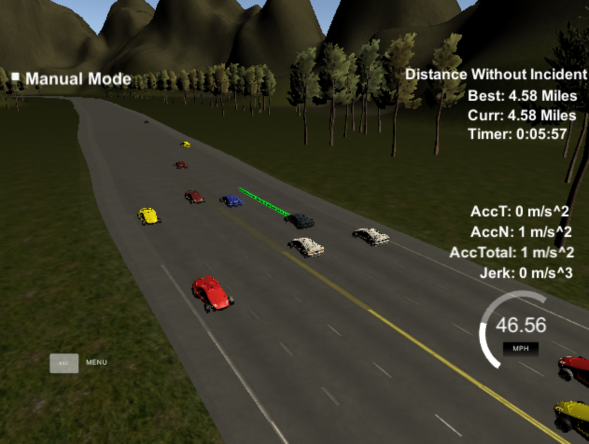
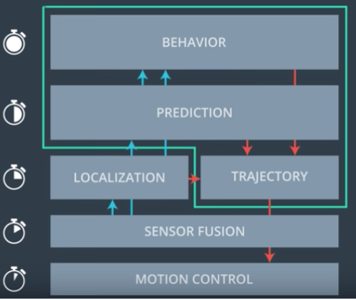
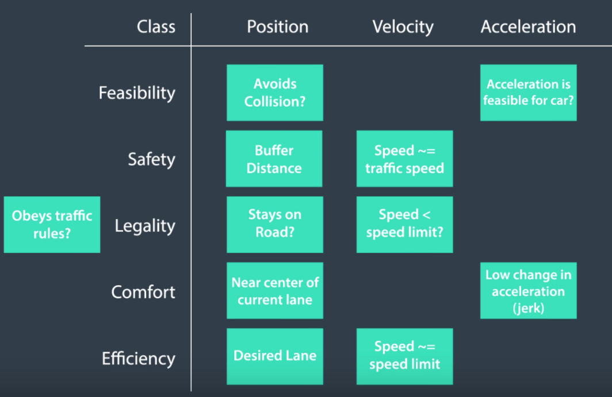

# CarND-Path-Planning-Project
Self-Driving Car Engineer Nanodegree Program
## Project Reflection
### Abstract
The path planning system was implemented to generate the trajectories given information from sensor fusion, map, and car status. The system supports the vehicle to safely navigate around a simulated highway with other traffic.  A test video (./Test_Video_PathPlanning.mp4) was recorded to provide an impression of the path planning performance. The following screenshot shows the car driving at 4.58 miles without incident.



### System Implementation
#### Overview
The system was implemented based on the proposed architecture.


There are :

* __Behaviour Planning__ (./src/behaviour.cpp): Get information from prediction module and car localization module. Make the decision on lane changing and the target car status. Transmit the target for trajectory generation.
* __Prediction__ (./src/prediction.cpp): Get the information from sensor fusion module. Predict the status of the surrounding cars in a period of time. Transmit the predictions for behaviour panning and trajectory evaluation.
* __Trajectory Generation__(./src/trajectory.cpp  ./src/cost.cpp): Get information from behaviour planning and car localisation to identify the start and the target waypoints and then generate the trajectory. Get information from prediction module to evaluate the trajectory candidates. Send the optimal trajectory to motion control module.

_(Motion control is beyond the scope of this project. sensor fusion and car localisation were also prepared and provided)_

#### Behaviour Planning

Decide the target(lane and speed), based on predictions(lane speed and safety distance) and the ego car states (id, x, y, vx, vy, s, d). The ego car was trying its best to run on max speed. Safety distance was used to adjust the car velocity and the distance to other cars nearby. Backup behaviour planning mechanism was also implemented for finding a collision free alternative. Some second best trajectories were proposed by slightly modify the speed and lanes.

#### Prediction
Predict the surrounding vehicles behaviour in the range of vision(waypoints), based on sensor fusion inputs and ego car states.

First, detect surrounding objects using sensor fusion outputs and states of ego car. Only the closest objects were detected, max 6 cars( 3 front + 3 back ) on 3 lanes. Second, predict the position of each object with time and vision_range. Those outputs will be used on the further trajectory validation check. Then, the safety distance of each lane was calculated based on the the velocity of the front and back cars, ego car deceleration, time latency and constant safety margin. At last, given the information of safety distance and detected objects speed, the max speed and max free space for each lane were calculated.

#### Trajectory generation
 Trajectories on both (s,d) and (x,y) coordinates were generated, based on behaviour target and previous path. The end part of previous path will be used as the begining of the next path, and thus the consistence will be kept.
JMT trajectory generation algorithm calculate the jerk-optimal connection between a start state P0 = [p0, p˙0, p¨0] and an end state P1 = [p1, p˙1, p¨1] within the time interval T := t1 − t0. Quintic polynomials are proofed that it is the jerk-optimal connection in a one-dimensional problem.  More information of JMT algorithm can be found at "Optimal Trajectory Generation for Dynamic Street Scenarios in a Frenet Frame" (s,d) trajectory was generated first and then converted to (x,y) coordinates. At higher speeds, d(t) and s(t) can be chosen independently. At extreme low speeds, this strategy disregards the non-holonomic property of the car, so that the majority of the trajectories has to be rejected due to invalid curvatures. Thus, the generator will switch below a certain velocity threshold to a slightly different trajectory mode generating the lateral trajectory in dependence on the longitudinal movement. In emergency situation, according to behaviour planning input, a special trajectory generate process will be triggered. It uses the fastest way to generated a trajectory with no changes on d. (stay in the same lane) and  keep constant acceleration or deceleration in 2sec waypoints. SAT (Separating Axis Theorem) collision detection algorithm was used to check the validation of trajectory candidates. Cost function was designed according to the following layers:

Different weights was arranged for each layers based on its importance. Feasibility was dispatched with the highest weights and the efficiency with the lowest.

#### Map:
The original map was 30 meters per waypoints. SPLINE was used to enhance the precision of the Map to 1 point every 1 meter. The conversion between (x,y) coordinates and (s.d) coordinates were also implemented here.


## Reference

* Moritz Werling, Julius Ziegler, So¨ren Kammel, and Sebastian Thrun.
Optimal Trajectory Generation for Dynamic Street Scenarios in a Frenet Frame

* https://github.com/PhilippeW83440/CarND-Path-Planning-Project

* SAT (Separating Axis Theorem) http://www.dyn4j.org/2010/01/sat/

* A. Takahashi, T. Hongo, Y. Ninomiya, and G. Sugimoto. Local
path planning and motion control for AGV in positioning

* Junior: The Stanford Entry in the Urban Challenge
https://www.researchgate.net/publication/227506544_Junior_The_Stanford_Entry_in_the_Urban_Challenge

* Towards fully autonomous driving: Systems and algorithms
https://www.researchgate.net/publication/224244859_Towards_fully_autonomous_driving_Systems_and_algorithms


### Simulator.
You can download the Term3 Simulator which contains the Path Planning Project from the [releases tab (https://github.com/udacity/self-driving-car-sim/releases/tag/T3_v1.2).

### Goals
In this project your goal is to safely navigate around a virtual highway with other traffic that is driving +-10 MPH of the 50 MPH speed limit. You will be provided the car's localization and sensor fusion data, there is also a sparse map list of waypoints around the highway. The car should try to go as close as possible to the 50 MPH speed limit, which means passing slower traffic when possible, note that other cars will try to change lanes too. The car should avoid hitting other cars at all cost as well as driving inside of the marked road lanes at all times, unless going from one lane to another. The car should be able to make one complete loop around the 6946m highway. Since the car is trying to go 50 MPH, it should take a little over 5 minutes to complete 1 loop. Also the car should not experience total acceleration over 10 m/s^2 and jerk that is greater than 10 m/s^3.

#### The map of the highway is in data/highway_map.txt
Each waypoint in the list contains  [x,y,s,dx,dy] values. x and y are the waypoint's map coordinate position, the s value is the distance along the road to get to that waypoint in meters, the dx and dy values define the unit normal vector pointing outward of the highway loop.

The highway's waypoints loop around so the frenet s value, distance along the road, goes from 0 to 6945.554.

## Basic Build Instructions

1. Clone this repo.
2. Make a build directory: `mkdir build && cd build`
3. Compile: `cmake .. && make`
4. Run it: `./path_planning`.

Here is the data provided from the Simulator to the C++ Program

#### Main car's localization Data (No Noise)

["x"] The car's x position in map coordinates

["y"] The car's y position in map coordinates

["s"] The car's s position in frenet coordinates

["d"] The car's d position in frenet coordinates

["yaw"] The car's yaw angle in the map

["speed"] The car's speed in MPH

#### Previous path data given to the Planner

//Note: Return the previous list but with processed points removed, can be a nice tool to show how far along
the path has processed since last time.

["previous_path_x"] The previous list of x points previously given to the simulator

["previous_path_y"] The previous list of y points previously given to the simulator

#### Previous path's end s and d values

["end_path_s"] The previous list's last point's frenet s value

["end_path_d"] The previous list's last point's frenet d value

#### Sensor Fusion Data, a list of all other car's attributes on the same side of the road. (No Noise)

["sensor_fusion"] A 2d vector of cars and then that car's [car's unique ID, car's x position in map coordinates, car's y position in map coordinates, car's x velocity in m/s, car's y velocity in m/s, car's s position in frenet coordinates, car's d position in frenet coordinates.

## Details

1. The car uses a perfect controller and will visit every (x,y) point it recieves in the list every .02 seconds. The units for the (x,y) points are in meters and the spacing of the points determines the speed of the car. The vector going from a point to the next point in the list dictates the angle of the car. Acceleration both in the tangential and normal directions is measured along with the jerk, the rate of change of total Acceleration. The (x,y) point paths that the planner recieves should not have a total acceleration that goes over 10 m/s^2, also the jerk should not go over 50 m/s^3. (NOTE: As this is BETA, these requirements might change. Also currently jerk is over a .02 second interval, it would probably be better to average total acceleration over 1 second and measure jerk from that.

2. There will be some latency between the simulator running and the path planner returning a path, with optimized code usually its not very long maybe just 1-3 time steps. During this delay the simulator will continue using points that it was last given, because of this its a good idea to store the last points you have used so you can have a smooth transition. previous_path_x, and previous_path_y can be helpful for this transition since they show the last points given to the simulator controller with the processed points already removed. You would either return a path that extends this previous path or make sure to create a new path that has a smooth transition with this last path.

## Tips

A really helpful resource for doing this project and creating smooth trajectories was using http://kluge.in-chemnitz.de/opensource/spline/, the spline function is in a single hearder file is really easy to use.

---

## Dependencies

* cmake >= 3.5
  * All OSes: [click here for installation instructions](https://cmake.org/install/)
* make >= 4.1
  * Linux: make is installed by default on most Linux distros
  * Mac: [install Xcode command line tools to get make](https://developer.apple.com/xcode/features/)
  * Windows: [Click here for installation instructions](http://gnuwin32.sourceforge.net/packages/make.htm)
* gcc/g++ >= 5.4
  * Linux: gcc / g++ is installed by default on most Linux distros
  * Mac: same deal as make - [install Xcode command line tools]((https://developer.apple.com/xcode/features/)
  * Windows: recommend using [MinGW](http://www.mingw.org/)
* [uWebSockets](https://github.com/uWebSockets/uWebSockets)
  * Run either `install-mac.sh` or `install-ubuntu.sh`.
  * If you install from source, checkout to commit `e94b6e1`, i.e.
    ```
    git clone https://github.com/uWebSockets/uWebSockets
    cd uWebSockets
    git checkout e94b6e1
    ```

## Editor Settings

We've purposefully kept editor configuration files out of this repo in order to
keep it as simple and environment agnostic as possible. However, we recommend
using the following settings:

* indent using spaces
* set tab width to 2 spaces (keeps the matrices in source code aligned)

## Code Style

Please (do your best to) stick to [Google's C++ style guide](https://google.github.io/styleguide/cppguide.html).

## Project Instructions and Rubric

Note: regardless of the changes you make, your project must be buildable using
cmake and make!


## Call for IDE Profiles Pull Requests

Help your fellow students!

We decided to create Makefiles with cmake to keep this project as platform
agnostic as possible. Similarly, we omitted IDE profiles in order to ensure
that students don't feel pressured to use one IDE or another.

However! I'd love to help people get up and running with their IDEs of choice.
If you've created a profile for an IDE that you think other students would
appreciate, we'd love to have you add the requisite profile files and
instructions to ide_profiles/. For example if you wanted to add a VS Code
profile, you'd add:

* /ide_profiles/vscode/.vscode
* /ide_profiles/vscode/README.md

The README should explain what the profile does, how to take advantage of it,
and how to install it.

Frankly, I've never been involved in a project with multiple IDE profiles
before. I believe the best way to handle this would be to keep them out of the
repo root to avoid clutter. My expectation is that most profiles will include
instructions to copy files to a new location to get picked up by the IDE, but
that's just a guess.

One last note here: regardless of the IDE used, every submitted project must
still be compilable with cmake and make./

## How to write a README
A well written README file can enhance your project and portfolio.  Develop your abilities to create professional README files by completing [this free course](https://www.udacity.com/course/writing-readmes--ud777).
